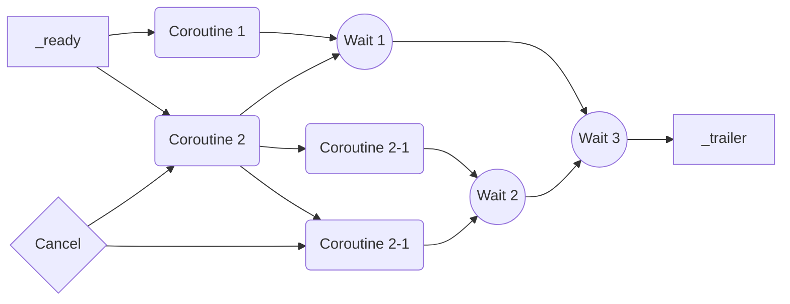

<br />

> [!IMPORTANT]
> このリポジトリはメンテナンスしていません。<br />
> Godot 4.0 以降であれば以下で代替え可能です:
> 
> * [folt-a/godot-nesink](https://github.com/folt-a/godot-nesink)
> * [xdut-task](https://github.com/ydipeepo/xdut-task)
> * [xdut-wait](https://github.com/ydipeepo/xdut-wait)

---

<br />
<br />
<br />

# Pseudo-async scripting helper for Godot 3

Godot 3.* で非同期っぽくスクリプトを書くためのアドオンです。



GDScriptFunctionState だと不足している完了/未完了の状態管理や、GDScript コルーチンによる非同期的処理の合流、外部からのシグナルもしくはメソッド呼び出しによる yield 待機のキャンセルを可能にします。 

```gdscript
func _coroutine1():
	yield(.get_tree().create_timer(randf()), "timeout")

func _coroutine2():
	yield(.get_tree().create_timer(randf()), "timeout")

func _ready():
	yield(Task.wait_all([_coroutine1(), _coroutine2()]), "completed")
	.get_tree().change_scene("res://scenes/Menu.tscn")
```

## 準備

デモプロジェクトを含んでいるため確認する場合はそのまま実行してください。
あなたのプロジェクトにこのアドオンを導入する場合は以下のステップに従ってください:

1. res://addons/godot-async-helper 以下を丸ごとあなたのプロジェクトの addons ディレクトリにコピーします。
2. AsyncHelper というプラグインが現れるので有効化します。
3. Task, TaskTimer というシングルトンが登録されていれば無事有効化できていますので、書く。

### 消すには…

AsyncHelper を無効化し godot-async-helper ディレクトリをあなたのプロジェクトから削除します。その後、プロジェクトをリロードしてください。

## 使いかた

このアドオンを有効化すると Task というシングルトンが追加され、いくつかのクラスがあなたのプロジェクト内のスクリプトから利用できるようになります。

### TaskUnit

非同期的処理の待機の単位となるユニットです。GDScriptFunctionState への変換が可能です。
独自の実装を行う場合 TaskUnitBase という半実装のクラスが定義されていますのでそちらを継承し実装します。
このクラスはいくつかのメソッドを公開します:

> #### `TaskUnit.has_completed() -> bool`
> このユニットが完了しているかどうかを返します。

> #### `TaskUnit.get_completed_count() -> int`
> このユニットに関連付けられたシグナルが完了 (発火) した回数を返します。

> #### `TaskUnit.wait() -> GDScriptFunctionState`
> このユニットを待機します。
>
> yield に渡す直前にこのメソッドを実行し GDScriptFunctionState に変換します:
> ```gdscript
> var unit: TaskUnit = ...
> yield(unit.wait(), "completed")
> ```

### Task (シングルトン)

このアドオンの中心となるシングルトンです。いくつかのメソッドを公開し、それらメソッドを通じて TaskUnit への変換を行うことができます。
このシングルトンは以下のいくつかの関数を公開します:

> #### `Task.empty() -> TaskUnit`
> 完了済みのユニットを返します。
>
> このユニットは何も待機しないため、即座に処理を返すユニットとなります。

> #### `Task.defer(object, signal_name, signal_discard_args, cancel_token_or_timeout) -> TaskUnit`
> 指定したシグナルが完了するまで待機するユニットを返します。
> - `object`
> ユニットで待機するシグナルを発火するオブジェクト。
> - `signal_name := "completed"` (省略可)
> ユニットで待機するシグナル名。
> - `signal_discard_args := 0` (省略可)
> ユニットで待機するシグナル引数の数。
> 現状引数を受け取ることはできないため正しいシグナル引数の数を指定し切り捨てます。
> - `cancel_token_or_timeout = null` (省略可)
> CancellationToken もしくは float でタイムアウト指定できます。
> 省略した場合はタイムアウトしません。
>
> シグナルの待機を後回しにする場合、事前に完了してしまう可能性がありますがそのような場合に使います:
> ```gdscript
> var unit1 := Task.defer(.get_tree().create_timer(2.0), "timeout")
> var unit2 := Task.defer(.get_tree().create_timer(1.0), "timeout")
> yield(unit1.wait(), "completed")
> yield(unit2.wait(), "completed") # ユニット内に状態が保存されているためデッドロックしません
> ```
 
> #### `Task.delay(timeout, cancel_token) -> TaskUnit`
> 指定したタイムアウトが経過するまで待機するユニットを返します。
> - `timeout: float`
> タイムアウトを指定します。
> - `cancel_token = null` (省略可)
> CancellationToken を指定できます。
> 省略した場合はタイムアウトが経過するまで待機します。
>
> 以下の unit1 と unit2 はほぼ同等です:
> ```gdscript
> var unit1 := Task.defer(.get_tree().create_timer(1.0), "timeout")
> var unit2 := Task.delay(1.0)
> ```

> #### `Task.delay_msec(timeout, cancel_token) -> TaskUnit`
> 指定したタイムアウトが経過するまで待機するユニットを返します。
>
> タイムアウトの単位が異なる以外は Task.delay() と同じです。

> #### `Task.delay_usec(timeout, cancel_token) -> TaskUnit`
> 指定したタイムアウトが経過するまで待機するユニットを返します。
> 
> タイムアウトの単位が異なる以外は Task.delay() と同じです。

> #### `Task.when_any(signal_specs, cancel_token_or_timeout) -> TaskUnit`
> 指定したシグナル定義のうちどれか一つが完了するまで待機するユニットを返します。
> - `signal_specs: Array`
> シグナル定義を含む配列。下記のコード例を参照してください。
> - `cancel_token_or_timeout = null` (省略可)
> CancellationToken もしくは float でタイムアウト指定できます。
> 省略した場合はタイムアウトしません。
>
> シグナル定義にはいくつかのフォーマットがあり、任意のフォーマットを組み合わせて指定することができます:
> ```gdscript
> var signal_spec1 = object                   # object の "completed" シグナルを待機、引数は 0 個破棄する
> var signal_spec2 = [object, "completed"]    # object の "completed" シグナルを待機、引数は 0 個破棄する
> var signal_spec3 = [object, "completed", 0] # object の "completed" シグナルを待機、引数は 0 個破棄する
> var signal_specs = [signal_spec1, signal_spec2, signal_spec3]
> ```

> #### `Task.when_all(signal_specs, cancel_token_or_timeout) -> TaskUnit`
> 指定したシグナル定義がすべて完了するまで待機するユニットを返します。
> - `signal_specs: Array`
> シグナル定義を含む配列。Task.when_any() のコード例を参照してください。
> - `cancel_token_or_timeout = null` (省略可)
> CancellationToken もしくは float でタイムアウト指定できます。
> 省略した場合はタイムアウトしません。

> #### `Task.wait(timeout, cancel_token) -> GDScriptFunctionState`
> 指定したタイムアウトが経過するまで待機します。
> - `timeout` (省略可)
> タイムアウトを指定します。省略した場合は Task.empty().wait() 呼び出しと同等となります。
> - `cancel_token = null` (省略可)
> CancellationToken を指定できます。
> 省略した場合はタイムアウトが経過するまで待機します。
>
> 戻り値は GDScriptFunctionState となりますので、即座に yield する場合に使うようにします。

> #### `Task.wait_any(signal_specs, cancel_token_or_timeout) -> GDScriptFunctionState`
> 指定したシグナル定義のうちどれか一つが完了するまで待機します。
> - `signal_specs: Array`
> シグナル定義を含む配列。Task.when_any() のコード例を参照してください。
> - `cancel_token_or_timeout = null` (省略可)
> CancellationToken もしくは float でタイムアウト指定できます。
> 省略した場合はタイムアウトしません。
>
> 戻り値は GDScriptFunctionState となりますので、即座に yield する場合に使うようにします。

> #### `Task.wait_all(signal_specs, cancel_token_or_timeout) -> GDScriptFunctionState`
> 指定したシグナル定義がすべて完了するまで待機します。
> - `signal_specs: Array`
> シグナル定義を含む配列。Task.when_any() のコード例を参照してください。
> - `cancel_token_or_timeout = null` (省略可)
> CancellationToken もしくは float でタイムアウト指定できます。
> 省略した場合はタイムアウトしません。
>
> 戻り値は GDScriptFunctionState となりますので、即座に yield する場合に使うようにします。

### CancellationTokenSource

TaskUnit ユニット作成時に外部からキャンセルできるようにする場合、このファクトリクラスを使います。

> #### `CancellationTokenSource.token -> CancellationToken`
> キャンセルトークンを作成し返します。

> #### `CancellationTokenSource.source_name -> string`
> キャンセルトークンソース名を返します。
>
> デバッグ時にキャンセルチェーンの追跡をしやすくするために使います。
> コンストラクタにソース名を渡した場合はこのプロパティから取得できます。

> #### `CancellationTokenSource.cancel_requested -> bool`
> キャンセルが要求されたかどうかを返します。

> #### `CancellationTokenSource.cancel() -> void`
> このソースにより作成されたすべてのトークンをキャンセルされた状態に変更します。

> #### `CancellationTokenSource.cancel_after(object, signal_name, signal_discard_args) -> bool`
> 指定したシグナルに継続してキャンセルされるようシグナルを接続します。
> - `object`
> キャンセルに継続させるシグナルを発火するオブジェクト。
> - `signal_name := "completed"` (省略可)
> キャンセルに継続させるシグナル名。
> - `signal_discard_args := 0` (省略可)
> キャンセルに継続させるシグナル引数の数。

### CancellationToken

CancellationTokenSource により作成されるトークン。TaskUnit ユニット内や、コルーチン内でキャンセルされたかどうかを待機したり観測するために使います。

> #### `CancellationToken.source_name -> string`
> キャンセルトークンソース名を返します。
> このトークンを作成した CancellationTokenSource.source_name に一致します。

> #### `CancellationToken.name -> string`
> キャンセルトークン名を返します。
> キャンセルトークンソース名にインスタンス識別子を加えた文字列になります。

> #### `CancellationToken.cancel_requested -> bool`
> キャンセルが要求されたかどうかを返します。

> #### `CancellationToken.wait() -> GDScriptFunctionState`
> このトークンを作成したソースがキャンセルされるまで待機します。

## いくつかの用例

デモに頻繁に出くわして困ったときの例を含めてありますが、ここではこのアドオンで解決できる例をいくつか提示します。

### 複数のコルーチンをまとめて待機したいがうまくいかない

いくつかのコルーチンを同時に開始したが完了順序が不明なため待機に困ってしまった例:

```gdscript
func _coroutine1():
	yield(.get_tree().create_timer(randf()), "timeout")

func _coroutine2():
	yield(.get_tree().create_timer(randf()), "timeout")

func _ready():
	var coro1 = _coroutine1()
	var coro2 = _coroutine2()
	yield(coro1, "completed")
	yield(coro2, "completed") # coro2 が先に完了しているとここでデッドロックする
	print("運よく 2 つとも完了した")
```

解決策:

```gdscript
# _coroutine1(), _coroutine2() はそのまま

func _ready():
	var unit1 := Task.defer(_coroutine1())
	var unit2 := Task.defer(_coroutine2())
	yield(unit1, "completed")
	yield(unit2, "completed") # 延長させたユニットは完了している場合即時に処理を返すのでデッドロックしない
	print("必ず 2 つとも完了する")
```

### どれか一つのコルーチンが完了するまで待機したいが複雑になってしまった

いくつかのコルーチンを開始したが、条件を判断するためにカウンタを追加したところコードフローを追いにくくなってしまった例:

```gdscript
# _coroutine1(), _coroutine2() はそのまま

var _counter := 0

func _ready():
	var coro1 = _coroutine1()
	var coro2 = _coroutine2()
	coro1.connect("completed", self, "_trailer")
	coro2.connect("completed", self, "_trailer")

func _trailer() -> void:
	_counter += 1
	if _counter == 1:
		print("1 つ完了した")
```

解決策:

```gdscript
# _coroutine1(), _coroutine2() はそのまま

func _ready():
	yield(Task.wait_any([_coroutine1(), _coroutine2()]), "completed")
	print("1 つ完了した")
```

両方とも完了するまで待機する場合は、Task.wait_all() というメソッドを使います。

### アニメーションを再生し、キーが押された場合は途中で止めたいがよくわからない

イントロ用にアニメーションを作ったが何度も見たくないのでスキップできるようにシグナルを繋げて色々条件を整えたがやはりコードフローが追いにくくなってしまった例:

```gdscript
func _ready() -> void:
	$AnimationPlayer.connect("animation_finished", self, "_on_animation_finished")
	$AnimationPlayer.play("intro")

func _input(event: InputEvent) -> void:
	if event is InputEventMouseButton and event.pressed:
		$AnimationPlayer.stop()
		_change_scene()

func _change_scene() -> void:
	.get_tree().change_scene("res://scenes/Game.tscn")

func _on_animation_finished(name: String) -> void:
	_change_scene()
```

解決策:

```gdscript
var _cancel := CancellationTokenSource.new()

func _ready():
	var unit := Task.defer($AnimationPlayer, "animation_finished", 1, _cancel.token)
	$AnimationPlayer.play("intro")
	yield(unit.wait(), "completed")
	.get_tree().change_scene("res://scenes/Game.tscn")

func _input(event: InputEvent) -> void:
	if event is InputEventMouseButton and event.pressed:
		_cancel.cancel()
```
